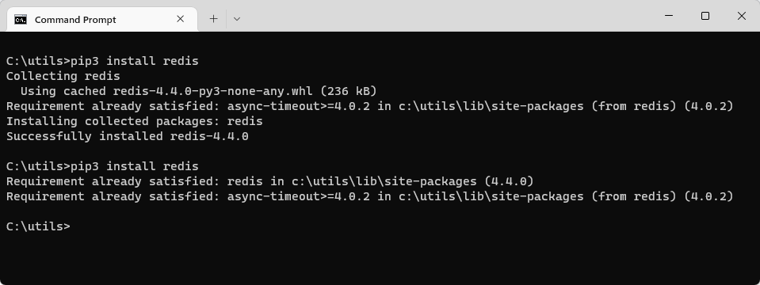

# Quickstart: Use Azure Cache for Redis in Python

This sample show you how to incorporate Azure Cache for Redis into a Python app. See the [accompanying article](https://docs.microsoft.com/azure/azure-cache-for-redis/cache-python-get-started) on the documentation site for details, including best practices and how to create the sample code from scratch.

## Prerequisites

- Azure subscription - [create one for free](https://azure.microsoft.com/free/)
- Python 3
   - For macOS or Linux, download from [python.org](https://www.python.org/downloads/).
   - For Windows 11, use the [Windows Store](https://www.microsoft.com/en-us/p/python-3/9nblggh083nz?activetab=pivot:overviewtab).

## Install redis-py

[Redis-py](https://pypi.org/project/redis/) is a Python interface to Azure Cache for Redis. Use the Python packages tool, `pip`, to install the `redis-py` package from a command prompt. 

The following example used `pip3` for Python 3 to install `redis-py` on Windows 11 from an Administrator command prompt.

## Run the sample

[Download the sample code to your development PC.](/README.md#get-the-samples)

Change directories to the folder containing this sample.

Edit the *PythonApplication1.py* source. Replace `<Your Host Name>` and `<Your Access Key>` with the values from your Azure Cache for Redis instance. Your host name is of the form *\<DNS name>.redis.cache.windows.net*.

Run *PythonApplication1.py* with Python.

> [!IMPORTANT]
> For Azure Cache for Redis version 3.0 or higher, TLS/SSL certificate check is enforced. ssl_ca_certs must be explicitly set when connecting to Azure Cache for Redis. For RedHat Linux, ssl_ca_certs are in the */etc/pki/tls/certs/ca-bundle.crt* certificate module.

## References

* [Quickstart article on the documentation site](https://docs.microsoft.com/azure/azure-cache-for-redis/cache-python-get-started)
