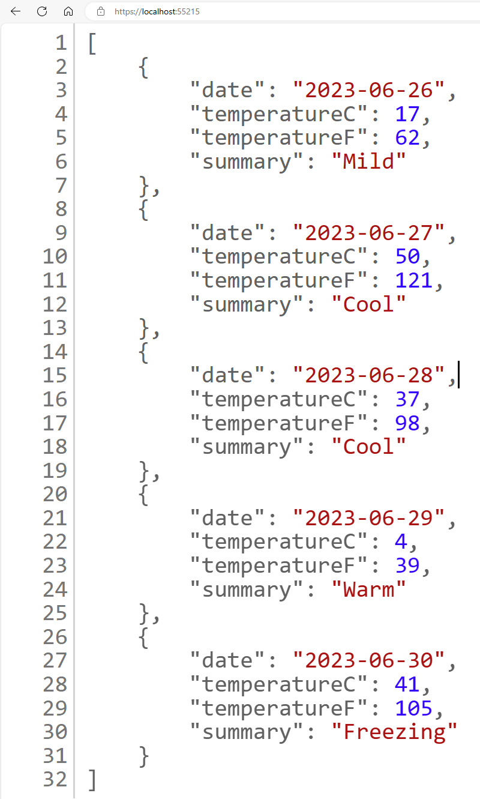
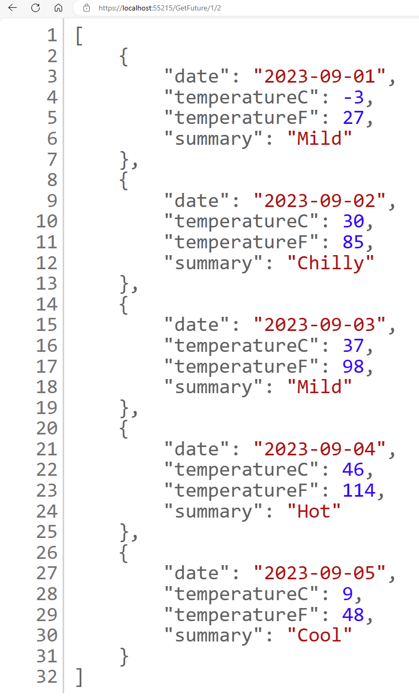
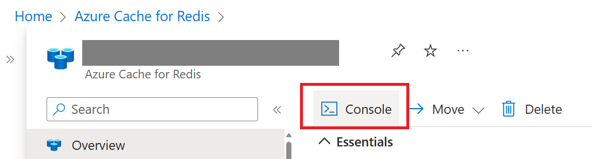
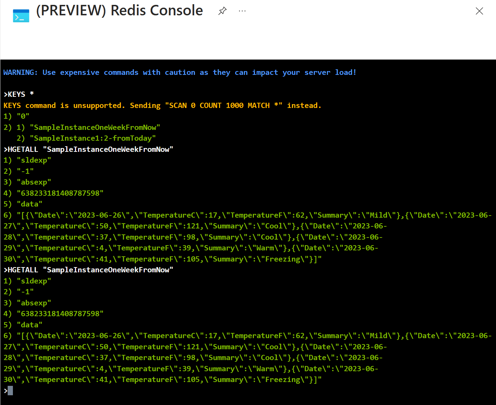

# Weather Forecast Web API Demo Using the New Distributed Cache Extension Methods
The new concept on a better .NET caching abtraction is presented by Marc Gravell's [Distributed Cache Demo](https://github.com/mgravell/DistributedCacheDemo/tree/main). This weather app is an example to show how to reuse the extension methods from Distributed Cache Demo code to cache weather forecast reports, with both stateless and stateful options. 

## Pre-requisites for running the Weather API app

* [Download .NET 7 or later](https://dotnet.microsoft.com/download)
* Sign-up for an Azure Subscription if you don't have one yet. [Start free](https://azure.microsoft.com/free/search/?ef_id=_k_e3d0541f9b0a11bc5dd030871a928aba_k_&OCID=AIDcmm5edswduu_SEM__k_e3d0541f9b0a11bc5dd030871a928aba_k_&msclkid=e3d0541f9b0a11bc5dd030871a928aba)
* [Setup Git command line](https://git-scm.com/downloads)

## Quickstart - running the app locally with Azure Cache for Redis
1. Create an Azure Cache for Redis. Follow instructions at [here](https://learn.microsoft.com/azure/azure-cache-for-redis/quickstart-create-redis-enterprise). 
    > **_NOTE:_** You can choose the tier (Basic, Standard, Premium, Enterprise) for the Redis Cache to create. Creating Enterprise SKU will take only ~5min, while other SKUs may take longer to be created. 

2. Open command prompt. Change directory to a folder location you want to run this sample code. Fork this sample code.

3. Download the forked sample code in your own Github repo:
    ```
     git clone https://github.com/<your_github_username>/WeatherAPI-DistributedCache.git
    ```

4. Make sure you are in the folder directory containing the .csproj file. Initialize user-secret for this project:
    ```
    dotnet user-secrets init
    ```

5. Navigate to [Azure Portal](https://aka.ms/publicportal). Browse to the Azure Cache for Redis instance you created. Go to Access Keys tab, obtain the primary connection string.

6. Set user secret to your project:
    ```
    dotnet user-secrets set "ConnectionStrings:MyRedisConStr" "Your_Redis_Connection_String"
    ```

7. Run the app:
    ```
    dotnet build
    set ASPNETCORE_ENVIRONMENT=Development
    dotnet run 
    ```

8. Launch the Web App locally following the output in command prompt. You will be able to see the weather forecast for the next week. Refreshing the browser will not change the result because the generated weather forecast is cached! The screenshot below shows invoking the URL to index action returns next week's weather forecast in JSON format.

    


9. View more weather forecast by appending /GetFuture/{numWeeks}/{numMonthsFromNow} to the URL. For example, https://localhost:55215/GetFuture/1/2 will show the weather forecast 2 months and 1 week from today. The screenshot below shows getting the future weather 2 months and 1 week from now.

    


10. Go to Azure portal, browse to your Azure Cache for Redis instance. Launch the Console tool per screenshot below.

    

11. Use KEYS * and HGETALL <your_cached_value_key> commands to view the cached weather forecast.

    