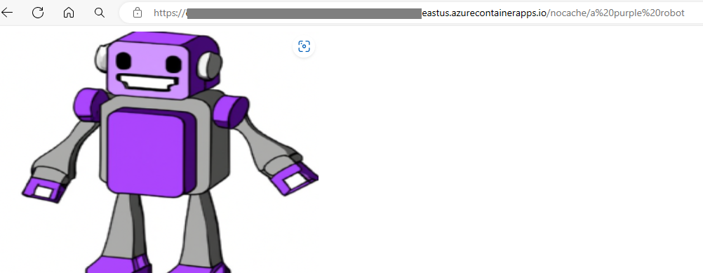
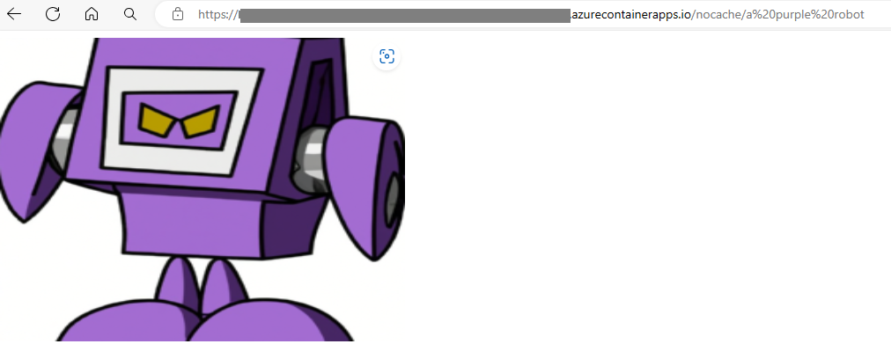
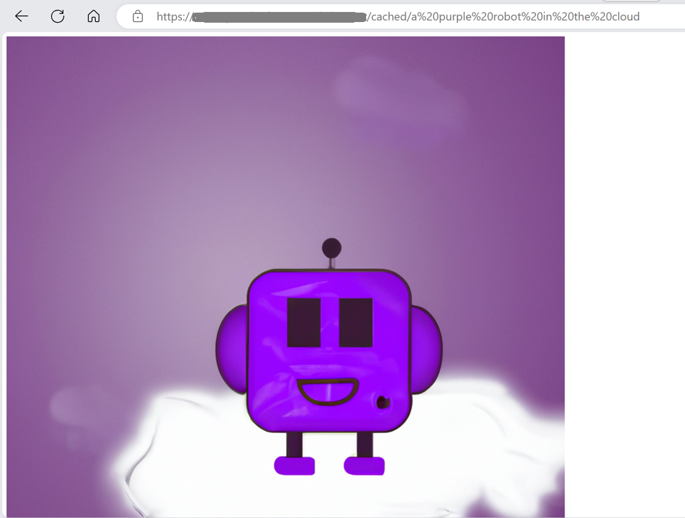
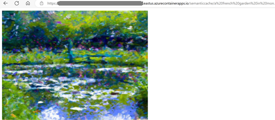
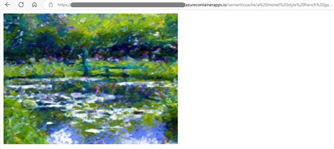

# .NET 8 Web Application with Redis Output Caching and Azure OpenAI

## Overview
This folder contains sample code for an AI image generation web application. It calls into Azure OpenAI DallE to generate images based on user prompt. There are two features the sample highlights:
* It allows responses from the /cached/ endpoint to be saved in Azure Cache for Redis through the [IOutputCache() abstraction](https://learn.microsoft.com/aspnet/core/performance/caching/output?preserve-view=true&view=aspnetcore-8.0#cache-storage). 
* It uses semantic caching to cache responses from similar prompts using the [Redis OM for .NET](https://github.com/redis/redis-om-dotnet)

To experiment with the demo:
1. call the /nocache/ endpoint in the URL in your browser. Refresh the browser. Observe that refresh takes a noticeable delay and a new picture will be generated.
2. call the /cached/ endpoint in the URL in your browser. Refresh the browser. Observe that the output picture does not change and refresh finishes instantly. 
3. call the /semanticcache/ endpoint in the URL in your browser. Enter two similar prompts such as "a french garden in monet style" and "a monet style french garden". Observe that the outputs are cached. 

Here are an example outputs:

**Figure 1**: /nocache/ endpoint returns a different picture upon each refresh





**Figure 2**: /cached/ endpoint caches web response rendered output



**Figure 3**: /semanticcache/ endpoint for "a french garden in monet style"



**Figure 3**: /semanticcache/ endpoiont for "a monet style french garden". Observe with semantic caching, the output is the same as Figure 2 above.



## Run the application in Azure

Prerequisites:
- Azure subscription. [Start free](https://azure.microsoft.com/free)
- .NET 8 or above. [Download](https://dotnet.microsoft.com/download/dotnet/8.0)
- Docker. [Get docker](https://docs.docker.com/get-docker/)
- Azure Developer CLI. [Install](https://learn.microsoft.com/azure/developer/azure-developer-cli/install-azd?tabs=winget-windows%2Cbrew-mac%2Cscript-linux&pivots=os-windows)
- Onboard your subscription(s) to Azure OpenAI service. [Azure OpenAI Service](https://azure.microsoft.com/products/ai-services/openai-service/?ef_id=_k_3f5cdbf9b7621328b33fbdbb24786555_k_&OCID=AIDcmm5edswduu_SEM__k_3f5cdbf9b7621328b33fbdbb24786555_k_&msclkid=3f5cdbf9b7621328b33fbdbb24786555)

1. Open a command prompt
2. Change directory to the project folder where azure.yaml file is located
3. Make sure docker is running. Use the following command to check:
    ```
    docker ps
    ```
    If docker daemon is not running, the output message will show that "docker process is not running" with additional information. For example:
    ```
    C:\redis\samples\tutorial\output-cache-open-ai>docker ps
    request returned Internal Server Error for API route and version
    http://%2F%2F.%2Fpipe%2Fdocker_engine/v1.45/containers/json
    , check if the server supports the requested API version
    ```
    If the docker process is running, it will show a table on the active containers. For example:
    ```
    C:\redis\samples\tutorial\output-cache-open-ai>docker ps
    CONTAINER ID   IMAGE     COMMAND   CREATED   STATUS    PORTS     NAMES
    ```
4. Run:
    ```
    azd up
    ```
5. Follow command prompt to enter environment name and select subscription
6. Since the Dall-E model is available in limited regions, select "East US" to ensure the demo works.
7. This will create all the resources needed to run the sample:
- Azure Container App instance and environment
- Azure Container Registry
- Azure OpenAI service
- Azure Cache for Redis Enterprise
- Azure Key Vault

8. To clean up the environment, run 
    ```
    azd down
    ```
